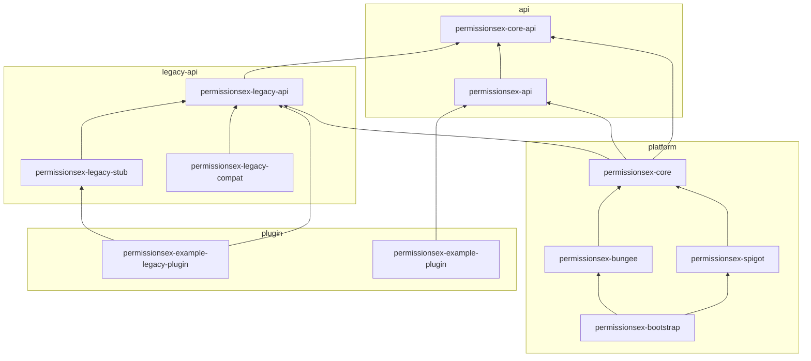

# PermissionsExPlus

PermissionsExPlus is a maintained fork of the original PermissionsEx (PEX) plugin for Bukkit/Spigot servers.

The goal of this fork is to keep PermissionsEx usable on modern server environments, preserve the familiar command structure, and continue maintenance for server administrators who still rely on PEX-style permission management.

## Overview

PermissionsExPlus provides a flexible permissions system with support for users, groups, inheritance, prefixes, suffixes, timed permissions, multi-world setups, and promotion ladders.

This fork is based on the original PermissionsEx project and keeps the same core plugin identity and command style where practical.

**Maven:** parent **`dev.rono.permissions:PermissionsExPlus`**. Runtime ships as **`permissionsex-bootstrap`** (universal jar). Hook plugins compile against **`permissionsex-legacy-api`** + **`permissionsex-legacy-stub`** (classic) and/or **`permissionsex-api`** (modern). See [Modules](#modules), [Hook plugin development](#hook-plugin-development), and **[API documentation](docs/api/README.md)**.



## Modules

Maven reactor order matches four groups (see root `pom.xml`). Maven still resolves **build order** from inter-module dependencies.

### `legacy-api` — classic hook compile surfaces

| Directory | Artifact ID | Ships in plugin jar? | Purpose |
|-----------|-------------|----------------------|---------|
| `legacy-api/permissionsex-legacy-api/` | `permissionsex-legacy-api` | Yes (shaded) | **Classic hook surface:** frozen `ru.tehkode.permissions.*` — `PermissionManager`, `PermissionUser`, `PermissionGroup`, events, `NativeInterface`, `ru.tehkode.utils.*`, backend interfaces. Baseline **`628215f`**. |
| `legacy-api/permissionsex-legacy-stub/` | `permissionsex-legacy-stub` | **No** | **Compile-only** `ru.tehkode.permissions.bukkit.PermissionsEx` static helpers. Not in the Spigot runtime classpath as a duplicate class. |
| `legacy-api/permissionsex-legacy-compat/` | `permissionsex-legacy-compat` | No (tests only) | Regression tests: MockBukkit smoke test + optional classic plugin JAR probe (`src/test/resources/plugin-jars/`). |

### `api` — modern integration SPI

| Directory | Artifact ID | Ships in plugin jar? | Purpose |
|-----------|-------------|----------------------|---------|
| `api/permissionsex-core-api/` | `permissionsex-core-api` | Yes (shaded) | Platform-neutral SPI: `PlatformAdapter`, bus dispatches, `SchedulerBridge`, `ContextResolver`. For platform hosts and deep integration. |
| `api/permissionsex-api/` | `permissionsex-api` | Yes (shaded) | **Modern hook surface:** `PermissionService` on Bukkit `ServicesManager`. Preferred entry for new companion plugins. |
| `api/permissionsex-api-bukkit/` | `permissionsex-api-bukkit` | No (optional compile) | Bukkit `Player` helpers for `PermissionService`. |

### `platform` — engine, runtimes, bootstrap

| Directory | Artifact ID | Ships in plugin jar? | Purpose |
|-----------|-------------|----------------------|---------|
| `platform/permissionsex-core/` | `permissionsex-core` | Yes (shaded) | Engine: manager, backends (YAML/SQL/multi), hierarchy, commands, config. Internal — not a hook compile dependency. |
| `platform/permissionsex-spigot/` | `permissionsex-spigot` | Yes (shaded) | Bukkit/Paper runtime: live `PermissionsEx` `JavaPlugin`, superperms bridge, Cloud commands, Bukkit events. |
| `platform/permissionsex-bungee/` | `permissionsex-bungee` | Yes (shaded) | Bungee/Waterfall proxy runtime and permission bridge. |
| `platform/permissionsex-bootstrap/` | `permissionsex-bootstrap` | **Install this jar** | Merges Spigot + Bungee → `PermissionsExPlus-{version}.jar`. |

### `plugin` — sample companion plugins

| Directory | Artifact ID | Ships in plugin jar? | Purpose |
|-----------|-------------|----------------------|---------|
| `plugin/permissionsex-example-legacy-plugin/` | `permissionsex-example-legacy-plugin` | Separate jar | Sample **classic** hook plugin (`legacy-api` + `legacy-stub`). |
| `plugin/permissionsex-example-plugin/` | `permissionsex-example-plugin` | Separate jar | Sample **modern** hook plugin (`permissionsex-api` only). |

### Namespace map

| Package | Role | Hook plugins? |
|---------|------|---------------|
| `ru.tehkode.permissions.*` | Classic PermissionsEx API (frozen) | **Yes** — via `permissionsex-legacy-api` |
| `ru.tehkode.permissions.bukkit.PermissionsEx` | Static entry points | **Yes** — via `permissionsex-legacy-stub` (compile) / live class (runtime) |
| `ru.tehkode.utils.*` | Classic helpers (`DateUtils`, `StringUtils`, …) | **Yes** — via `permissionsex-legacy-api` |
| `dev.rono.permissions.api.*` | Modern integration SPI | **Yes** — via `permissionsex-api` / `permissionsex-core-api` |
| `dev.rono.permissions.core.*` | Implementation internals | **No** — not a supported hook surface |

More detail: [`ARCHITECTURE.md`](ARCHITECTURE.md). Hook plugin APIs: [`docs/api/README.md`](docs/api/README.md).

## Hook plugin development

PEX is already on the server at runtime (`plugins/PermissionsExPlus-*.jar`). Your plugin only needs **compile-time** dependencies with `scope` **`provided`** — do not shade PEX into your jar.

### Classic (old) API hook — `ru.tehkode.*`

For plugins originally written against PermissionsEx 1.23.x (`PermissionsEx.getPermissionManager()`, `PermissionUser`, Bukkit events, etc.).

**Two artifacts, two jobs:**

| Dependency | What it gives you |
|------------|-------------------|
| **`permissionsex-legacy-api`** | All **types and contracts**: `PermissionManager`, `PermissionUser`, `PermissionGroup`, `PermissionBackend`, `NativeInterface`, `PermissionsExConfig`, Bukkit events (`PermissionEntityEvent`, …), exceptions, `ru.tehkode.utils.*`. This is the bulk of the classic API. |
| **`permissionsex-legacy-stub`** | Only the **`PermissionsEx` static class** — convenience methods that delegate to the registered `PermissionManager` on the server. It is **not** the plugin itself; it exists so your IDE/compiler can resolve `PermissionsEx.getUser(player)` without depending on the full Spigot module. |

```xml
<dependency>
  <groupId>dev.rono.permissions</groupId>
  <artifactId>permissionsex-legacy-api</artifactId>
  <version>1.23.5</version>
  <scope>provided</scope>
</dependency>
<dependency>
  <groupId>dev.rono.permissions</groupId>
  <artifactId>permissionsex-legacy-stub</artifactId>
  <version>1.23.5</version>
  <scope>provided</scope>
</dependency>
<dependency>
  <groupId>org.spigotmc</groupId>
  <artifactId>spigot-api</artifactId>
  <scope>provided</scope>
</dependency>
```

**When you need only one:** if your plugin never calls `PermissionsEx.*` static methods and only uses `PermissionManager` from `ServicesManager` or events, you can depend on **`permissionsex-legacy-api` alone**. Add **`permissionsex-legacy-stub`** when you use `PermissionsEx.getPermissionManager()`, `PermissionsEx.getUser(...)`, or `PermissionsEx.isAvailable()`.

**Runtime:** the server provides the real `ru.tehkode.permissions.bukkit.PermissionsEx` (`JavaPlugin`) and registers `PermissionManager` on `ServicesManager`. Pre-1.23.5 PEX hook JARs should run **without recompiling** if they only used the classic public API.

Working example: [`plugin/permissionsex-example-legacy-plugin/`](plugin/permissionsex-example-legacy-plugin/). Full reference: **[Legacy API docs](docs/api/LEGACY_API.md)**.

### Modern (new) API hook — `dev.rono.*`

For new integrations that should not depend on the frozen `ru.tehkode.*` surface. Full reference: **[Modern API docs](docs/api/MODERN_API.md)**. Planned additions: **[API roadmap](docs/api/FUTURE.md)**.

#### Maven dependencies

Most companion plugins only need **`permissionsex-api`**:

```xml
<dependency>
  <groupId>dev.rono.permissions</groupId>
  <artifactId>permissionsex-api</artifactId>
  <version>1.23.5</version>
  <scope>provided</scope>
</dependency>
<dependency>
  <groupId>org.spigotmc</groupId>
  <artifactId>spigot-api</artifactId>
  <scope>provided</scope>
</dependency>
```

Add **`permissionsex-core-api`** only if you implement a **custom platform host** or need bus/platform types at compile time (unusual for normal Bukkit plugins):

```xml
<dependency>
  <groupId>dev.rono.permissions</groupId>
  <artifactId>permissionsex-core-api</artifactId>
  <version>1.23.5</version>
  <scope>provided</scope>
</dependency>
```

| Artifact | Package root | Intended consumer |
|----------|--------------|-------------------|
| `permissionsex-api` | `dev.rono.permissions.api.service` | Companion plugins on **Spigot/Paper** |
| `permissionsex-core-api` | `dev.rono.permissions.api.runtime`, `.bus` | Platform adapters, core tests, advanced integration |

#### Runtime registration (Spigot/Paper only)

On game servers, PEX registers **`PermissionService`** on Bukkit **`ServicesManager`**. The same object also implements legacy **`PermissionManager`** — modern and classic APIs share one runtime manager.

```java
RegisteredServiceProvider<PermissionService> reg =
        getServer().getServicesManager().getRegistration(PermissionService.class);
if (reg != null) {
    PermissionService pex = reg.getProvider();
    getLogger().info("PEX backend: " + pex.backend().simpleName());
    getLogger().info("Users: " + pex.users().count()
            + ", groups: " + pex.groups().count());
}
```

**Bungee/Waterfall:** `PermissionService` is **not** published via `ServicesManager` on proxies. Use legacy `PermissionManager` where available or proxy-specific integration.

New features are added on **`dev.rono.permissions.api.*`** only — the legacy `PermissionManager` interface is not expanded.

---

### Modern API reference

Detailed documentation lives under **[`docs/api/`](docs/api/README.md)**:

| Document | Contents |
|----------|----------|
| [MODERN_API.md](docs/api/MODERN_API.md) | `PermissionService`, subjects, world contexts, timed permissions |
| [LEGACY_API.md](docs/api/LEGACY_API.md) | Classic `PermissionManager`, events, stub |
| [FUTURE.md](docs/api/FUTURE.md) | Recommended API additions and gaps |

Summary below; see the linked docs for complete method lists and examples.

#### `PermissionService` (`permissionsex-api`)

Primary entry: flat methods on **`PermissionService`**. Lookup: `ServicesManager.getRegistration(PermissionService.class)`.

| Method | Description |
|--------|-------------|
| **`user(uuid)`** / **`user(name)`** | Materialize user; `hasPermission("node")` checks global namespace |
| **`findUser(uuid\|name)`** | Optional persisted lookup via `FoundUser` |
| **`world(w).user(uuid)`** | Per-world permission checks |
| **`users().count()`** / **`groups().count()`** / **`worlds().count()`** | Registry counts |
| **`backend().getActive()`** / **`activate(alias)`** | Backend snapshot and administration |
| **`events()`** / **`reload()`** / **`session().start()`** | Events, reload, batch edits |
| **`group(name)`** | Direct group access |

See [Flat API](docs/api/MODERN_API.md#flat-api-canonical-entry) for the full reference.

Source: `api/src/main/java/dev/rono/permissions/api/service/PermissionService.java`

#### `PermissionSubject`, `User`, `Group` (`permissionsex-api`)

Subject operations are accessed through `User` and `Group` instances from `PermissionService`. Both extend `PermissionSubject`.

| `PermissionSubject` | Description |
|---------------------|-------------|
| `type()`, `identifier()`, `name()`, `virtual()` | Subject metadata |
| `has(permission, world)` / `hasPermission(permission)` | Effective check (global when world omitted) |
| `permissions(world)` | Direct assignments (not inherited) |
| `effectivePermissions(world)` | Merged permissions after inheritance |
| `addPermission` / `removePermission` / `setPermissions` | Direct permission CRUD |
| `addTimedPermission` / `removeTimedPermission` / `timedPermissions` | Timed permission nodes |
| `timedPermissionEntries(world)` / `allTimedPermissionEntries()` | Timed nodes with remaining seconds |
| `timedPermissionRemainingSeconds(permission, world)` | Seconds until a timed permission expires |
| `configuredWorlds()` | Worlds where this subject has data |
| `permissionsByWorld()` / `effectivePermissionsByWorld()` | Per-world permission maps |
| `inWorld(world)` / `global()` | World-scoped view (`SubjectWorldContext`) |
| `prefix` / `suffix` / `setPrefix` / `setSuffix` | Chat meta |
| `option` / `setOption` / `options` | Arbitrary options map |
| `save()` / `delete()` | Persist or remove the subject |

| `User` (additional) | Description |
|---------------------|-------------|
| `uniqueId()` | Parsed UUID when identifier is UUID-shaped |
| `groups(world)` / `groups(world, inherit)` | Group membership |
| `inGroup(name, world, inherit)` | Membership test |
| `addGroup` / `removeGroup` | Group membership CRUD (supports timed membership) |
| `timedGroupMemberships(world)` / `allTimedGroupMemberships()` | Timed group memberships with remaining seconds |
| `groupMembershipRemainingSeconds(group, world)` | Seconds until timed membership expires |
| `inWorld(world)` / `global()` | World-scoped view (`UserWorldContext`) |

| `Group` (additional) | Description |
|----------------------|-------------|
| `weight()` / `setWeight()` | Sort weight |
| `isDefault(world)` / `setDefault(value, world)` | Default group flag |
| `parents(world)` | Direct parent groups |
| `parentTree(world)` | Expanded ancestor groups |
| `addParent` / `removeParent` / `setParents` | Inheritance CRUD |
| `isChildOf(name, world, inherit)` | Hierarchy test |
| `rank()` / `rankLadder()` / `setRank(rank, ladder)` | Rank ladder metadata |
| `memberIdentifiers(world)` / `members(world)` | Users in this group |
| `activeMembers()` / `activeMembers(inherit)` | Online members |
| `inWorld(world)` / `global()` | World-scoped view (`GroupWorldContext`) |

#### World helpers & timed records

| Type | Description |
|------|-------------|
| `Worlds.GLOBAL` | Global namespace (`null`); empty strings normalize to global |
| `TimedPermissionEntry` | Record: permission, world, remainingSeconds |
| `TimedGroupMembership` | Record: groupName, world, remainingSeconds |
| `SubjectWorldContext` | World-scoped permission/meta view for any subject |
| `UserWorldContext` | Adds group membership operations |
| `GroupWorldContext` | Adds inheritance/default operations |

`world` is `null` or empty for the global context (classic PEX `null` world). Prefer `user.inWorld("world_nether").addPermission("node")` for world-specific edits.

Sources: `api/src/main/java/dev/rono/permissions/api/subject/`, `api/src/main/java/dev/rono/permissions/api/world/`

#### `PlatformAdapter` (`permissionsex-core-api`)

Platform-neutral host bridge implemented by Spigot/Bungee runtimes. **Not registered on `ServicesManager`** — internal to PEX and platform modules. Documented here for authors of alternate hosts or deep integration.

| Method | Description |
|--------|-------------|
| `uuidToName(UUID)` | Resolve online display name, or `null` |
| `nameToUuid(String)` | Resolve UUID from name, or `null` |
| `isOnline(UUID)` | Whether the holder is connected |
| `serverId()` | Logical server / container UUID |
| `realmNames()` | World names (game server) or backend ids (proxy) |
| `publish(PermissionDispatch)` | Emit engine notification (see bus types below) |
| `onlineRealm(UUID)` | Current world/realm when online, else `null` |
| `onlineDisplayName(UUID)` | Display name when online, else `null` |
| `isOperator(UUID)` | Operator flag when online |

On Spigot, `SpigotPermissionsExPlugin` implements this interface; game-server logic is delegated to `SpigotPlatformBridge`.

Source: `api/permissionsex-core-api/src/main/java/dev/rono/permissions/api/runtime/PlatformAdapter.java`

#### Bus dispatches (`permissionsex-core-api`)

Immutable notifications from the engine to the active `PlatformAdapter`. On **Spigot**, `SpigotEventPublisher` translates these into legacy Bukkit events (`ru.tehkode.permissions.events.*`) for hook plugins.

| Type | Role |
|------|------|
| `PermissionDispatch` | Sealed root: `EntityDispatch` \| `SystemDispatch` |
| `EntityDispatch` | Record: `(sourceId, entityIdentifier, entityType, mutation)` — user/group change |
| `SystemDispatch` | Record: `(sourceId, mutation)` — engine/system change |
| `EntityMutation` | `PERMISSIONS_CHANGED`, `OPTIONS_CHANGED`, `INHERITANCE_CHANGED`, `INFO_CHANGED`, `TIMEDPERMISSION_EXPIRED`, `RANK_CHANGED`, `DEFAULTGROUP_CHANGED`, `WEIGHT_CHANGED`, `SAVED`, `REMOVED` |
| `SystemMutation` | `BACKEND_CHANGED`, `RELOADED`, `WORLDINHERITANCE_CHANGED`, `DEFAULTGROUP_CHANGED`, `DEBUGMODE_TOGGLE`, `REINJECT_PERMISSIBLES` |

**Listening from a hook plugin today:** subscribe to legacy **`PermissionEntityEvent`** / **`PermissionSystemEvent`** on Spigot rather than consuming bus records directly.

Sources: `api/permissionsex-core-api/src/main/java/dev/rono/permissions/api/bus/`

#### Supporting runtime types (`permissionsex-core-api`)

| Type | Role |
|------|------|
| `ContextResolver` | Functional: `realmFor(UUID)` — maps a holder to an active realm/world slug |
| `SchedulerBridge` | `runSync`, `runAsync`, `runLater` — host scheduling abstraction |

These are used inside PEX platform wiring, not typical hook-plugin entry points.

#### Minimal modern hook example (Spigot)

Modern-only integration via `PermissionService`:

```java
import dev.rono.permissions.api.service.PermissionService;
import dev.rono.permissions.api.subject.User;
import org.bukkit.entity.Player;
import org.bukkit.event.player.PlayerJoinEvent;
import org.bukkit.plugin.RegisteredServiceProvider;

public void onEnable() {
    RegisteredServiceProvider<PermissionService> reg =
            getServer().getServicesManager().getRegistration(PermissionService.class);
    if (reg == null) {
        getLogger().warning("PermissionsEx is not available.");
        return;
    }
    PermissionService pex = reg.getProvider();
    getLogger().info("PEX " + pex.backend().simpleName()
            + " — " + pex.groups().count() + " groups");
}

public void onJoin(PlayerJoinEvent event, PermissionService pex) {
    Player player = event.getPlayer();
    if (BukkitPermissions.on(player).hasPermission("my.permission")) {
        pex.world(player.getWorld().getName())
                .user(player.getUniqueId())
                .addPermission("joined.today");
        pex.user(player.getUniqueId()).save();
    }
}
```

For a full modern sample, see [`plugin/permissionsex-example-plugin/`](plugin/permissionsex-example-plugin/). For classic `PermissionsEx.*` static entry points, see [`plugin/permissionsex-example-legacy-plugin/`](plugin/permissionsex-example-legacy-plugin/).

### Which API should I use?

| Situation | Use |
|-----------|-----|
| Maintaining an existing PEX hook plugin | **Legacy API** + **legacy stub** (if you call `PermissionsEx.*`) |
| Brand-new plugin on a PEX server | **Modern API** (`PermissionService`) |
| Listening to permission change events on Spigot | **Legacy API** events (`ru.tehkode.permissions.events.*`) — still published on game servers |
| Proxy (Bungee) integration | **Modern / core** paths; Bukkit events are not fired on proxy |

## Compatibility

| Topic | Detail |
|-------|--------|
| **Minecraft** | Target **1.8.8 – 1.26.1** on Spigot/Paper and compatible forks |
| **Java (this build)** | **Java 21+** required to run the plugin jar (bytecode is Java 21) |
| **Legacy hook plugins** | Classic `ru.tehkode.*` contract restored to **`628215f`**; see [`docs/api/LEGACY_API.md`](docs/api/LEGACY_API.md) |
| **Bungee / Waterfall** | Same universal jar; see [`bootstrap/README.md`](bootstrap/README.md) |
| **Pre-release verification** | [`docs/testing/REAL_SERVER_MATRIX.md`](docs/testing/REAL_SERVER_MATRIX.md) |
| **Full notes** | [`docs/COMPATIBILITY.md`](docs/COMPATIBILITY.md) |
| **Example configs** | [`docs/examples/`](docs/examples/) |

**Caveat:** “1.8.8 – 1.26.1” means the plugin **loads and is intended to work** across that range on a **Java 21+** host. Hosts still on Java 8 need a separate legacy bytecode build (not yet provided). Real-world soak testing on your target versions is recommended before production.

## Features

- User and group permission management
- Group inheritance and hierarchy support
- Prefix and suffix management
- Timed permissions and timed group membership
- Multi-world permission handling
- Permission ladder promotion and demotion
- Runtime backend inspection and switching
- UUID conversion support
- Debug and reporting tools

## Current status (`1.23.5`)

| Area | State |
|------|--------|
| **Build** | `mvn test` passes on the full reactor |
| **Spigot/Paper** | Compiles against **1.21.x** API; suitable for staging / dogfooding |
| **Bungee** | Compiles and tests against BungeeCord API |
| **Legacy hook plugins** | `ru.tehkode.*` contract restored to baseline **`628215f`**; see `ARCHITECTURE.md` |
| **Release** | **`1.23.5`** — run the [real-server matrix](docs/testing/REAL_SERVER_MATRIX.md) before production |
| **Minecraft** | Target range **1.8.8 – 1.26.1** ([compatibility notes](docs/COMPATIBILITY.md)) |

MockBukkit full-server tests **skip automatically** when the test Paper API does not match the compile-time Spigot API. Unit and backend tests still run.

## Roadmap

### Done

- [x] **Modern platform abstractions** — `dev.rono.permissions.api` (`PlatformAdapter`, bus dispatches, `PermissionService`)
- [x] **Automated tests for core permission logic** — hierarchy, matcher, backends, commands, concurrency, legacy contract tests (~30 test classes)
- [x] **Legacy API cleanup and isolation** — `legacy-api` + `legacy-stub` split, `InternalPermissionManager`, `legacy-compat` module, utils in `legacy-api`
- [x] **Documentation** — `ARCHITECTURE.md`, `docs/COMPATIBILITY.md`, `docs/testing/REAL_SERVER_MATRIX.md`, `docs/examples/`
- [x] **MockBukkit / Paper 1.21.11 alignment** — Paper test API matches Spigot compile API; hook smoke test in `legacy-compat`
- [x] **Config validation** — `PexYamlValidator` + `PexConfigValidator` with clear error messages
- [x] **Example configurations** — `docs/examples/config.yml`, `docs/examples/permissions.yml`
- [x] **Release `1.23.5`** — version bumped from SNAPSHOT
- [x] **Minecraft 1.8.8–1.26.1 target** — `ServerVersions` range checks + compatibility doc (Java 21 runtime required)
- [x] **Partial: reload / superperms refresh** — selective `PermissiblePEX` cache invalidation, `RELOADED` system dispatch (needs more real-server soak time)
- [x] **Partial: legacy plugin JAR regression** — optional probe in `legacy-compat` (`plugin-jars/`)

### Still planned

- [ ] Improve reload stability and permission attachment refresh behavior (production soak)
- [ ] Improve tab completion and command usability
- [ ] Add migration helpers for older PermissionsEx data layouts
- [ ] Expand UUID migration and offline player handling
- [ ] Improve backend compatibility and database reliability
- [ ] Add clearer logging and debug output for permission resolution issues
- [ ] CI builds and automated release packaging *(optional — not enabled in this repo yet)*
- [ ] Investigate a web editor or external management UI
- [ ] Java 8 bytecode profile for true 1.8.8 JVM hosts *(current build requires Java 21)*

## Maven

If you are building from source with Maven:

```bash
mvn clean package
```

The compiled plugin jars are produced under each module’s `target/` directory (see **Universal merged jar** below).

### Universal merged jar (Spigot/Paper **and** Bungee proxy)

Use the **`bootstrap`** module when you want **one artifact** that works on backends and proxies:

```bash
mvn clean package -pl bootstrap -am
```

Outputs: **`bootstrap/target/PermissionsExPlus-{version}.jar`** (module: **`dev.rono.permissions:permissionsex-bootstrap`**)

Install that jar on each server (`plugins/` on backends, same path on Bungee). See **`bootstrap/README.md`** for loader routing (`plugin.yml` vs **`bungee.yml`**).

**Before swapping to the merged jar, remove older PEX jars** from **`plugins/`** so the server cannot load two copies. Delete any shaded platform-only jars, for example:

- **`permissionsex-spigot-*.jar`** and **`permissionsex-bungee-*.jar`** (modular shaded builds under **`dev.rono.permissions`**)
- Older coordinates: **`ru.tehkode:permissionsex-*`**
- Legacy fork jar names if present: **`PermissionsExPlus-spigot-*.jar`**, **`PermissionsExPlus-bungee-*.jar`**, **`PermissionsExPlus-bootstrap-*-universal.jar`**

Keep only **`PermissionsExPlus-{version}.jar`** on that installation when using the bootstrap merge path (plus unrelated plugins).

## Installation

1. Build the project with Maven or download a compiled release (**universal jar** recommended if you run both backends and Bungee; see above).
2. Remove conflicting older PermissionsEx jars from **`plugins/`** (standalone **`permissionsex-spigot`** / **`permissionsex-bungee`**, legacy **`PermissionsExPlus-*`** or **`ru.tehkode`** coordinates, etc.) if migrating to **`PermissionsExPlus-{version}.jar`**.
3. Place the jar file (or jars, if using separate proxies/backends intentionally) in your server’s **`plugins/`** directory.
4. Start or restart the server.
5. Configure groups, users, and permissions using commands or configuration files.

## Commands

### Main command

```text
/pex
```

### General commands

```text
/pex - Display help
/pex reload - Reload environment
/pex report - Report an issue with PEX
/pex config <node> [value] - Print or set a config node
/pex backend - Print currently used backend
/pex backend <backend> - Change permission backend on the fly
/pex hierarchy [world] - Print complete user/group hierarchy
/pex import <backend> - Import data from another backend
/pex convert uuid - Bulk convert user data to UUID-based storage
/pex toggle debug - Enable or disable debug mode
/pex help [page] [count] - Show command help
```

### User commands

```text
/pex users list
/pex user <user>
/pex user <user> list [world]
/pex user <user> superperms
/pex user <user> prefix [newprefix] [world]
/pex user <user> suffix [newsuffix] [world]
/pex user <user> toggle debug
/pex user <user> check <permission> [world]
/pex user <user> get <option> [world]
/pex user <user> delete
/pex user <user> add <permission> [world]
/pex user <user> remove <permission> [world]
/pex user <user> swap <permission> <targetPermission> [world]
/pex user <user> timed add <permission> [lifetime] [world]
/pex user <user> timed remove <permission> [world]
/pex user <user> set <option> <value> [world]
/pex user <user> group list [world]
/pex user <user> group add <group> [world] [lifetime]
/pex user <user> group set <group> [world]
/pex user <user> group remove <group> [world]
/pex users cleanup <group> [threshold]
```

### Group commands

```text
/pex groups list [world]
/pex group <group>
/pex group <group> list [world]
/pex group <group> create [parents]
/pex group <group> delete
/pex group <group> add <permission> [world]
/pex group <group> remove <permission> [world]
/pex group <group> swap <permission> <targetPermission> [world]
/pex group <group> set <option> <value> [world]
/pex group <group> weight [weight]
/pex group <group> prefix [newprefix] [world]
/pex group <group> suffix [newsuffix] [world]
/pex group <group> toggle debug
/pex group <group> timed add <permission> [lifetime] [world]
/pex group <group> timed remove <permission> [world]
/pex group <group> users
/pex group <group> user add <user> [world]
/pex group <group> user remove <user> [world]
```

### Parent and rank commands

```text
/pex group <group> parents [world]
/pex group <group> parents list [world]
/pex group <group> parents set <parents> [world]
/pex group <group> parents add <parents> [world]
/pex group <group> parents remove <parents> [world]
/pex default group [world]
/pex set default group <group> <value> [world]
/pex group <group> rank [rank] [ladder]
/pex promote <user> [ladder]
/pex demote <user> [ladder]
```

### World commands

```text
/pex worlds
/pex world <world>
/pex world <world> inherit <parentWorlds>
```

## Standalone commands

```text
/promote <user> - Promotes a user to the next group
/demote <user> - Demotes a user to the previous group
```

## Permission Nodes

```text
permissionsex.disabled
```

Disables regex-based permission matching for players who should not have it applied.

## Example Usage

```text
/pex group admin create
/pex group admin add '*'
/pex user Steve group set admin
/pex user Alex add essentials.home
/pex group moderator prefix [Mod]
/pex promote Steve
```

## Why this fork exists

PermissionsEx was widely used, but the original project became unmaintained.

PermissionsExPlus exists to continue that legacy with active fixes, updated compatibility, and a clearer long-term home for the plugin.

## Credits

- Original authors: `t3hk0d3`, `zml`
- Additional fork attribution: `Rono`
- Original project: PermissionsEx

## License

PermissionsExPlus is licensed under the GNU General Public License v2.0 or later.
See the [LICENSE](LICENSE) file for the full text.

## Contributing

Contributions, bug reports, and compatibility fixes are welcome.

Please open an issue or submit a pull request with a clear description of the change.